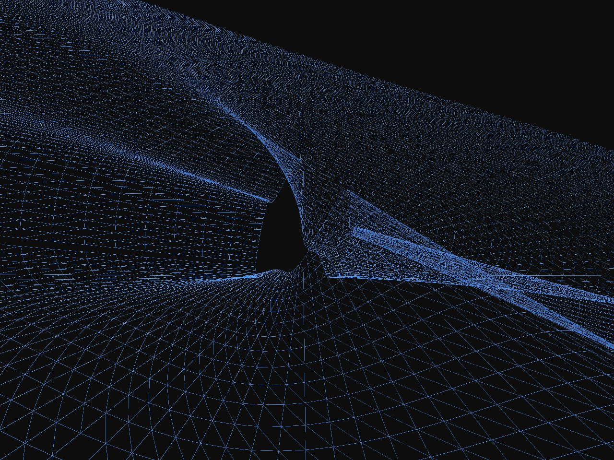

# BH@H Visualization Toolkit




This BH@H Visualization Toolkit provides a foundation for visualizing simulation data produced by the [BlackHoles@Home](https://blackholesathome.net/) project (and others) using Python and [Mayavi](https://docs.enthought.com/mayavi/mayavi/). 

</br>

[](https://opensource.org/licenses/MIT)  


## Usage

Whether you have your own data or you'd like to use existing databases, simply clone this repository into a new folder and navigate to [the comprehensive step-by-step guide](jupyter_notebooks/Tutorial-Start_to_Finish-Psi4_to_mp4.ipynb) to create your first movie!

The `primary_scripts` folder has all you need to make a polished 3D movie using either $\psi_4$ or strain ($h$) data from your own runs using Einstein Toolkit/BHaH or existing simulations from the SXS and RIT databases.
The `auxiliary_scripts` folder is mostly older or incomplete visualization styles I experimented with, but they should all work with the SXS database if you're curious.

To use the scripts, run the following lines to get started:

#### Windows

```
git clone https://github.com/RalsG/bh_vis.git
cd bh_vis
Python -m venv .venv
.venv/scripts/Activate.ps1
pip install -r requirements.txt
```

#### UNIX/OSX

```
git clone https://github.com/RalsG/bh_vis.git
cd bh_vis
python3 -m venv .venv
source .venv/bin/activate
pip install -r requirements.txt
```

To use these scripts with your own data, take a look at the `primary_scripts/psi4_to_strain.py` file, which (as the name suggests) converts $\psi_4$ data stored as time series SWSH coefficients into strain ($h$) stored in the same way. It requires the extraction radius and minimum and maximum $\mathcal{l}$ numbers (integer degree) of your data, as well as the final time step size and a cutoff factor to trim longer signals. This option is designed to work with BHaH data, so the final visualization script will prefer horizon data from the BlackHoles@Home Apparent Horizon Algorithm (BHaHAHA). As mentioned below, capability for additional data formats is welcome.


## Resources

If you haven't already, check out [(bh@h)](https://blackholesathome.net/blackholesathome_homepage-en_US.html) to volunteer some of your processing power for the simulation of black hole collisions! And in the meantime, further data to be visualized can be found from the following sources:

1. [(Zenodo GW150914)](https://zenodo.org/records/155394)
2. [(SXS Collaboration)](https://data.black-holes.org/waveforms/index.html)
## Contributing

Pull requests and forks are welcome!
